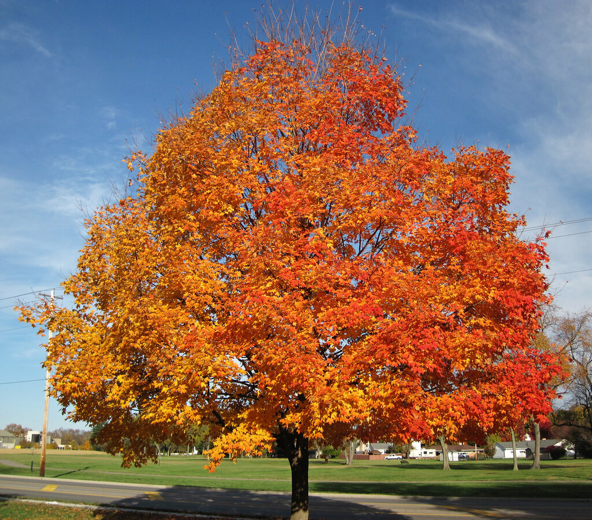
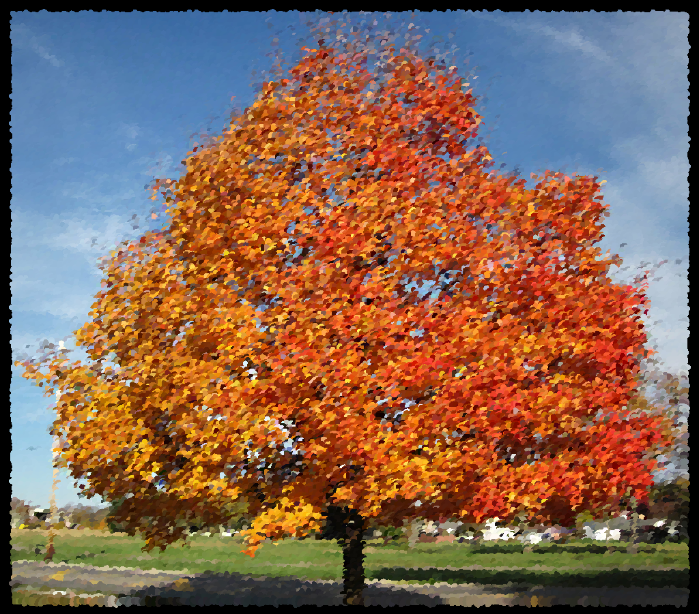
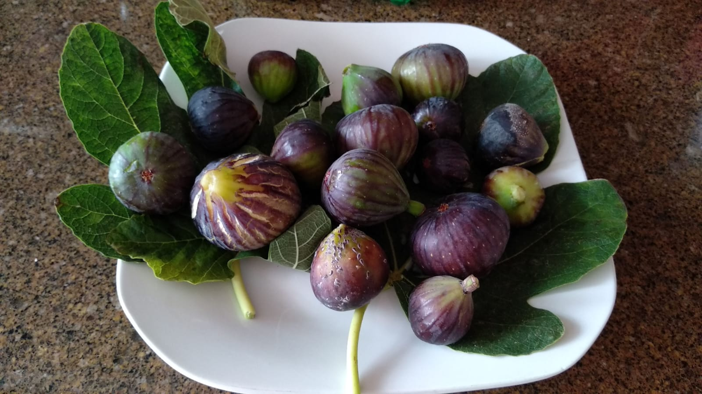
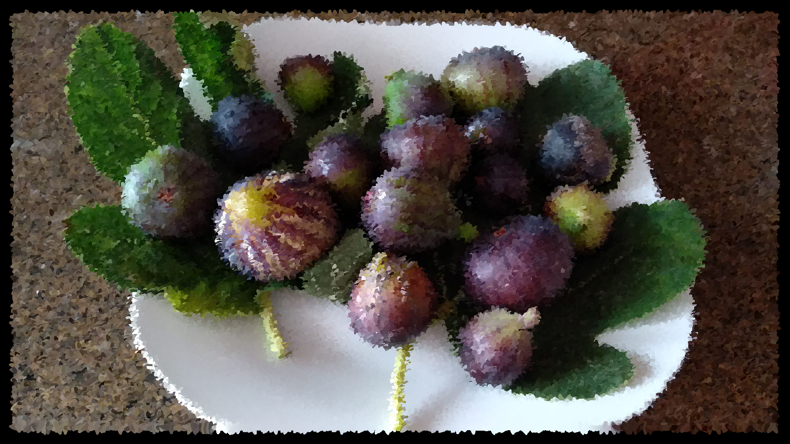
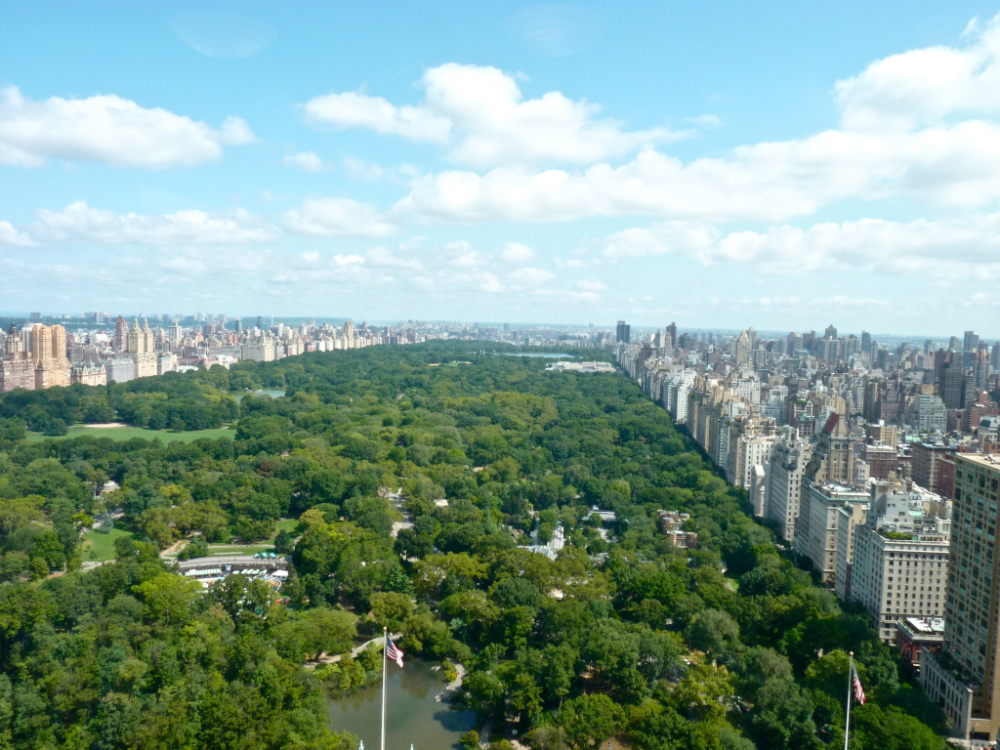
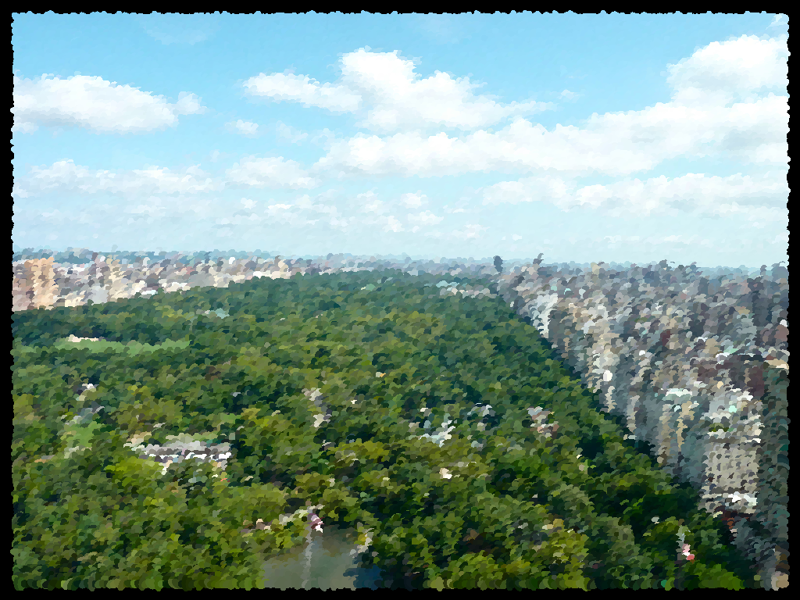

# oilify

Small python script for converting any image into an impressionist oil painting.

There are many algorithms with the same purpose and with better aesthetic results, but the key of this one is that it is *fast*. The biggest drawback is that it does not respect the edges of the shapes, while others do.

## Usage

`$ python oilify.py <input image path> <output image path> [options]`

Options:

* `-s <integer>` — Brush size. (default: 5.0)
* `-e <float>` — Expression level. (default 2.0)
* `-r <int>` — Random seed. (default: 0)

## Examples

`$ python oilify.py examples/flower.jpg examples/flower_oil.png -s 10`

`$ python oilify.py examples/wave.jpg examples/wave_oil.png`

`$ python oilify.py examples/tree.jpg examples/tree_oil.png`

`$ python oilify.py examples/mountain.jpg examples/mountain_oil.png`

`$ python oilify.py examples/figs.jpg examples/figs_oil.png -e 3`

`$ python oilify.py examples/central_park.jpg examples/central_park_oil.png`

`$ python oilify.py examples/cloister.jpg examples/cloister_oil.png`

`$ python oilify.py examples/goleta.jpg examples/goleta_oil.png`

